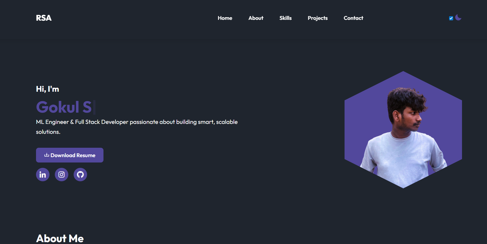

# 🌐 Personalized Portfolio Website

A clean and responsive **Personal Portfolio Website** built using **HTML** and **CSS** to showcase your skills, projects, and contact information. This website is fully customizable and perfect for students, developers, and job seekers.

## 📸 Preview

  

## 🚀 Features

- Responsive design for mobile and desktop
- Home, About, Skills, Projects/Portfolio, Contact sections
- Resume download button
- Smooth scroll and clickable navbar links
- Custom styling with modern fonts and layout
- Clean and minimal UI

## 🛠️ Tech Stack

- HTML5
- CSS3
- Google Fonts
- Font Awesome (optional for icons)

